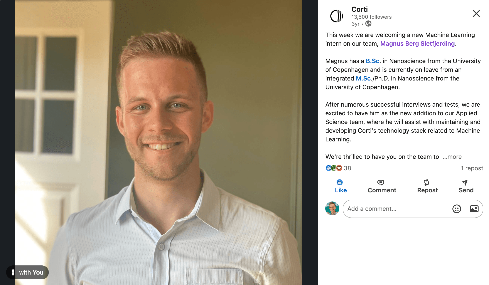

+++
title = 'Goodbye Corti - 4 years of building'
date = 2024-04-05T10:18:08+02:00
draft = false
+++
I've had a blast, but after almost 4 years, it's time for something new.

## Corti was new beginnings. 

From the first day my time at Corti was filled with excitement, and after a 9-month internship I decided to [leave my Ph.D. programme to work full-time for Corti.](../bye-phd-hi-corti).
Now I'm once more looking for new projects, without being completely sure what that means. 

## 🥷 Working in a startup means doing everything
Joining Corti's team of ~15 engineers meant a lot of time spent working throughout the entire Machine Learning stack. 
Already the first month I touched Torch/TF code, trained models, ingested data into Corti's data API, tested models' deployment performance, managed Azure clusters and deployed code to live customers. 
As the burden of responsibility was shared the risk of taking on responsibilities and tasks was low. The culture, all in all, was very focused on the principles [Yes, and ... / No, but ...](https://en.wikipedia.org/wiki/Yes,_and...) as well as "Radical Candor". These worked well in our case when Corti was small - but scaling the culture to a larger org was difficult. I'm not sure if this is universal to all organizations or just the one I joined.

<!-- ## 🧠 Corti was a lot of learning 

I was extremely fortunate to work under the leadership of some very thoughtful leaders and among extremely conscientious colleagues.    -->

## 💭 Following your motivation is hard

One of my early managers advised me early on that "you can be good at whatever you want, but make sure you find something you like". This advice, though liberating, can also be immensely frustrating, as [choice overload](https://thedecisionlab.com/biases/choice-overload-bias) starts to set in. In my last 1.5 years in Corti, I've been lucky to work on a diverse series of projects, like 
- Move DAG Orchestration functionality to the backend/DB functions.
- Rebuilding our Go Backend to take over deprecated Python services' tasks
- Play with LLMs for summarization and alignment work
- Build Data Platforms for customers to access their own data
- Conduct user interviews and supporting the change management team working with clients
- Present Corti's work to students in Computer Science, Product Design, and Data Science

All of these have been exciting and motivating in their own ways, so choosing a definite path is challenging based on these. 
Throughout my last year, thought, I've lost a series of good colleagues, and as Corti as a company has scaled, the culture has changed in ineffable but noticeable ways. 
I didn't realize it until I read Derek Sivers' [Hell Yeah Or No](https://sive.rs/n) which pretty much sums it up: 
> If you’re not saying “HELL YEAH!” about something, say no.

Framing it this way made it clear I wasn't feeling "Hell Yeah" about working at Corti anymore. I felt like that [when I started](/blog/bye-phd-hi-corti.md), I don't anymore, but I love to feel the *Hell Yeah* about my work again. But seeking employment while being employed is a huge cognitive dissonance in my eyes - so it's a little easier to just take the first step and quit. I know and hope the team at Corti will continue working towards making healthcare better while I find my next project. 

## 🚵 Taking a break from work
Working with brilliant people to solve hard problems is always rewarding - but at times it can be exhausting. 
Before trying anything else I'll be taking a break from the 9-to-5 to climb, bike, and look around my neighborhood. [See what I'm up to here](/travel)!
