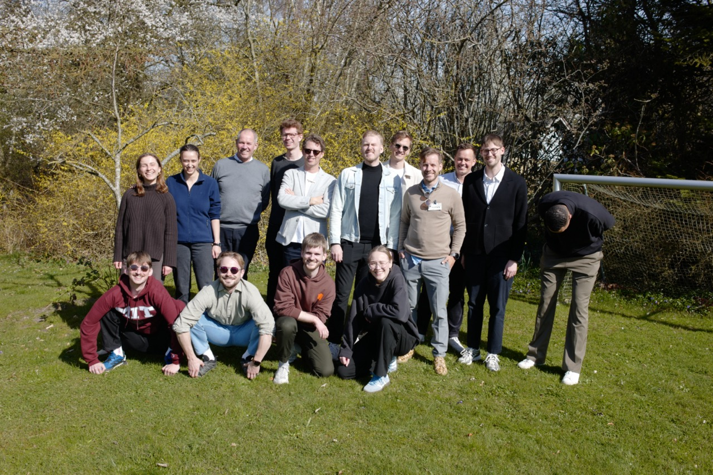
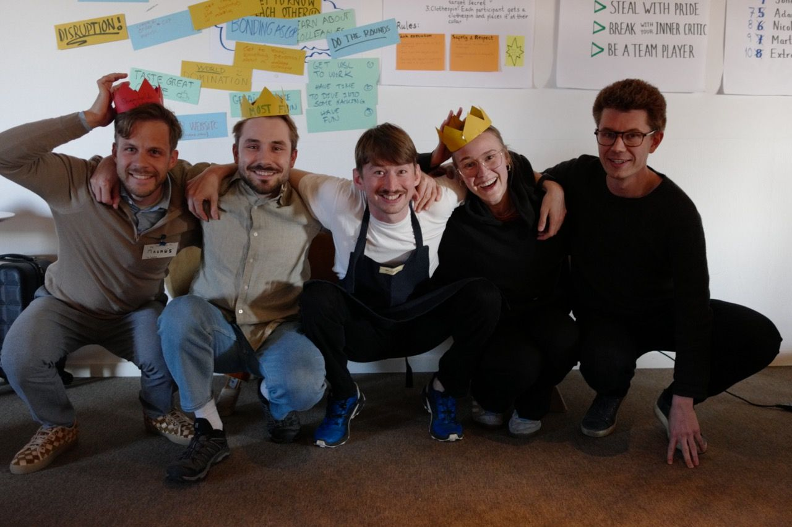
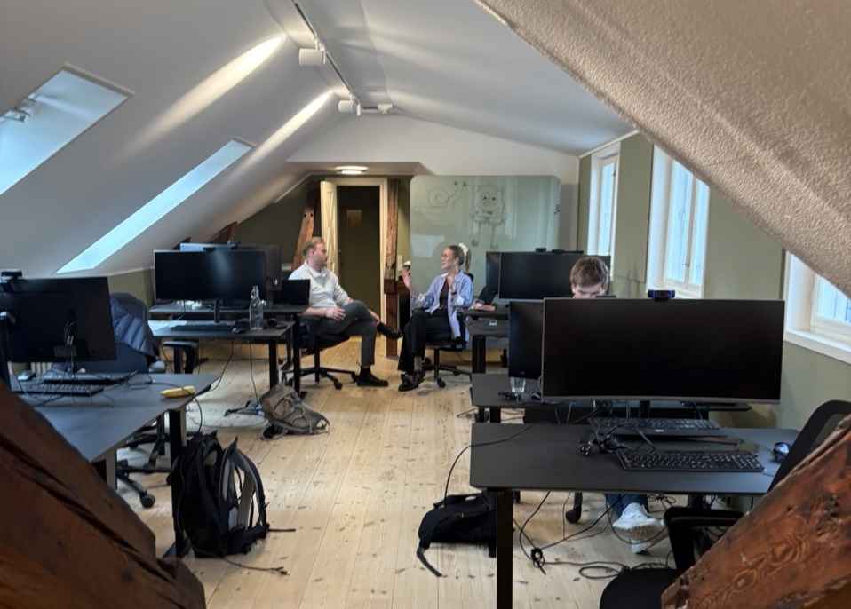
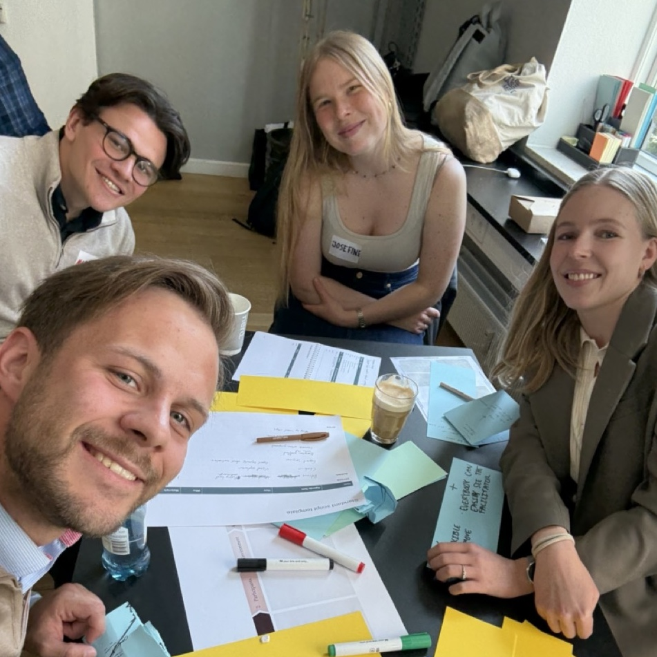

+++
title = 'Conversational AI from here to infinity'
date = 2025-04-22T07:00:00+02:00
draft = false
+++
One year after [leaving Corti](./bye-corti), a lot has happened in Tech in Copenhagen - [Corti released their Foundation Model for healthcare](https://www.corti.ai/foundation-models) and I've returned from my  [year of adventure](../year-of-adventure) to start a new job. This week I joined the brilliant team built by [Mads](https://x.com/madskaysen) and [Jesper](https://alkestrup.com/) building Conversational AI (CAI) in [TheTechCollective](https://thetechcollective.eu/). 
I'm beyond excited - the "[Hell Yeah](https://sive.rs/hellyeah)"  heuristic was already high going in, and after a week it's off the charts. 

## Why I'm so excited to work here

### 🚀 The CAI Team itself
Every conversation I've had with these people has left me _super stoked_ to work with them. 
I've been following people from the team for some years now, and their ideas about how to build technology that effectively enhances organizations are incredibly inspiring. 

### 💼 Office-first culture
It's no secret that I love traveling, and I've done my fair share of that in the last year. 
A reflection I had while traveling, howereve, is that the most profound experiences of my travels was getting to know other people.

At work, this tracks - I love my colleagues, and I love spending time with them. Being in a place where the office culture is emphasised makes it tons easier to come in, which makes for more social interactions a day. I couldn't be more excited to meet more of these people every day.

### 🤖 The things we're building
At the moment in time, the world has gotten its eyes up for the potential for impact brought by AI. 
That opens a lot of doors for building products and services centered around AI - but there's a catch here. 
Making sure that these impacts are long-lasting, positive, and in the right direction requires technical expertise _and_ a business perspective. 
The team at TTC has a good track record of doing exactly that and I think it's the right place to be, at the right time, with the right people. 

### 🪄 Doing more of what's motivating
The most exciting projects I did in Corti was the ones where I could work closely with customers. When looking at at new employment this was one of my main signals for employment, and here I can see myself using both technical and personal skills to (hopefully) help other organizations grow.

## Intensity from the start
The team introduction, in this round, was the most intense I've experienced so far. 
I was invited for a 2-day offsite hackathon with the entire 15 person extended team, and we were immediately set off to ~vibe-code~ hack away. 
To my great fortune I was paired up with Adam, and we built a LARP game management system focusing on email-based quest interactions, character management, and location tracking.
Alas, this was not enough to win the entire hackathon, but we made the podium! As a first time vibe coding my way towards success I was quite satisfied and happy to have met the entire team.
 

## Like a startup, but in a Big Corp
In my first week I was surprised at how _startuppy_ working with the team felt. 
Almost like in my [onboarding in Corti](./bye-phd-hi-corti/), I was immediately pulled into meetings, asked to review and contribute code, project descriptions, and slides.

Our office space (the Loft) reflects this too - with programmers, designers, and commercial functions working side by side, I immediately thought I had stepped back into a seed-stage startup.

## Consulting means facilitation
A side bonus of being part of [Implement](https://implementconsultinggroup.com/) is that people like me - techies - are actively invited to develop the toolbox available to general consultants. Already in my first week I was invited to join a Facilitation Training, learning how Implement runs workshops. As all the facilitation I've done in the past has been through NGOs and educational initiatives (thank you, [EYP](https://eyp.org)), having a professional perspective on these was very eye-opening. 

## I'm officially an "Implementer" 🎉
I sincerely believe that I'm once more in the right place at the right time. I'll continue to explore Copenhagen's tech space as best I can, and follow where my curiosity takes me.

